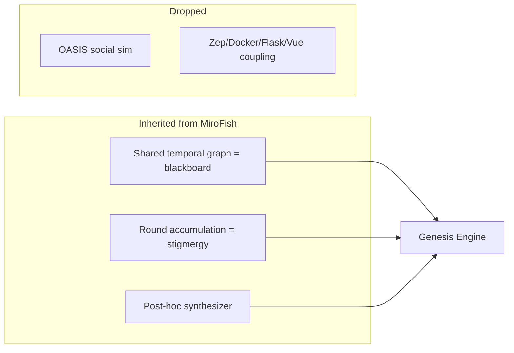
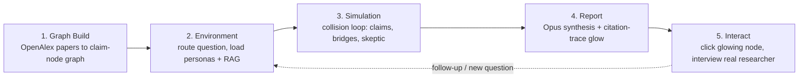
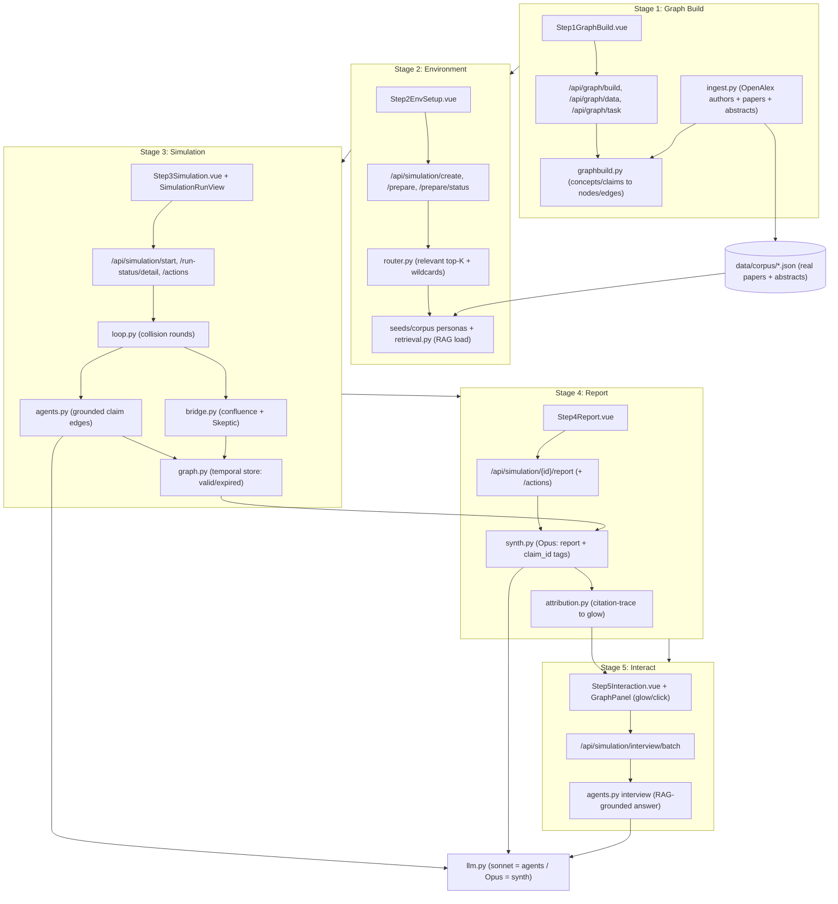
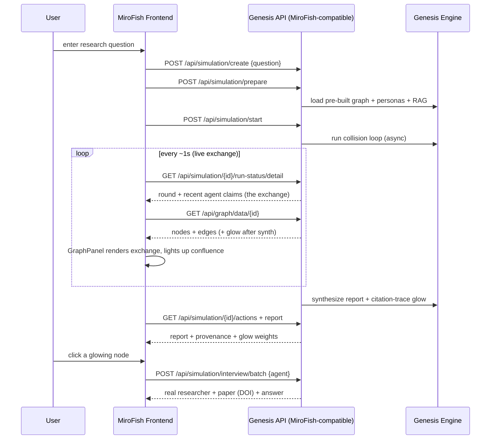
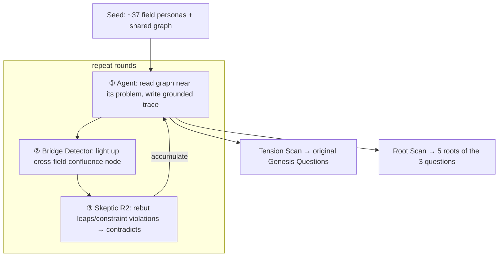

# Genesis Engine — Architecture & Build Plan

> **A cross-disciplinary collision engine.** It takes a user's research question and lets
> real researchers' *actual papers* (OpenAlex RAG) collide on a graph to produce
> **leads, hypotheses, and follow-up questions** as a single report — and shows **which
> researcher's paper sparked which idea** via auditable provenance (glow).
> It does not assert answers — it produces *creative leads worth verifying*.

Status: core co-discovery pipeline + OpenAlex ingestion (43 disciplines, real data) verified. This document is the single design source of truth for the **Ask Mode (user-question) pivot** build.

## Two modes
- **Ask Mode (primary, new)**: user question → activate relevant agents → collision → grounded report + glow provenance. ← the main hackathon demo.
- **Genesis / Explore Mode (secondary)**: the engine discovers its own fundamental questions (Tension/Root Scan). Kept as a "wow" secondary demo (§6).

---

## 0. Decision log (why it looks this way)

| Decision | Choice | Reason |
|---|---|---|
| Answers vs questions | **Question/lead engine** | "Answers about origins" hallucinate and can't be verified. The deepest unanswered questions can be found structurally on the graph and are verifiable. |
| MiroFish fork vs new | **New (standalone)** | The hackathon explicitly allows a "standing start" as a first-class path. Zep/OASIS/Docker/Flask are weight we don't use and live-failure surface. Inherit only MiroFish's **3 core ideas**. |
| Dependencies | **stdlib-only core + swappable brain** | Mock mode needs zero keys/installs → won't break on stage. Only live mode needs `anthropic`. |
| Referee | **No single judge → 3-way split** | MiroFish has no central decider (stigmergy). Verification is distributed across graph / loop / post-hoc. |
| MiroFish frontend | **Reuse the Vue frontend as-is via an API adapter** (revised) | Cut build time: keep the 5-step wizard + `GraphPanel.vue`, and make our Python core answer MiroFish's endpoints with the same JSON. Only add an `influence` field for glow. (See §1.6.) |
| Model assignment | **Hybrid: agents = sonnet-4.6, referee/synth/Root = Opus 4.8** | MiroFish uses one shared model (`gpt-4o-mini`) for all agents. We run the volume (agents × rounds) cheaply on sonnet, and only the hard fusion/scoring/root synthesis on Opus → lower cost + higher "Opus 4.8 Use (15%)". Models are shared; "being that researcher" comes from persona + paper context (no per-agent model/history — the graph is the memory). |
| Researcher grounding | **Real-paper RAG (OpenAlex abstracts ingested + injected)** | A faithful implementation of "each agent starts having read the papers." The model is generic sonnet; the injected corpus makes it that researcher. Disk cache + persona fallback for offline safety. |
| **Primary flow** | **User-question Ask Mode** (auto-discovery → secondary) | "Engine discovers its own questions" is abstract and hard to verify. "My question is answered by real papers colliding + I see whose paper" lands instantly and is far more demoable. |
| **Framing** | **leads/hypotheses/follow-ups, not "answers"** | "An engine that answers any question" dies to "isn't that just ChatGPT?". Position it as an ideation/serendipity tool → dodges hallucination critique + matches real researcher demand. |
| **Attribution (glow)** | **citation-trace (auditable), not vibes** | LLM self-reported influence is fabricated. The synthesizer tags the claim ids it used per sentence → glow = actual cited contributions. Clicking a node reveals that claim + paper (DOI). The trust anchor. |

## 1. Inheritance: only MiroFish's 3 backbones



- **Collection = shared-graph accumulation**: agents do not talk directly. They leave traces on the graph; others read them next round.
- **Truth update = temporal invalidation**: edges (facts) carry `valid/expired`. On conflict, old beliefs are retired → knowledge evolves.
- **Decision = post-hoc synthesis**: a referee reads the accumulated graph afterward and synthesizes the question/report.

## 1.5 Ask Mode — the user-question collision pipeline (primary flow)

```mermaid
flowchart TD
    Q["User question (web input)"] --> R["① Router: question → relevant top-K fields<br/>+ 2-3 wildcards (controlled serendipity)"]
    PG["Pre-built graph<br/>(43→215 agents' paper-claim nodes)"] --> R
    R --> L
    subgraph L [② Collision loop (2-3 bounded rounds)]
        L1["Active agents: write grounded claims<br/>from question + RAG excerpts (paper/DOI attached)"] --> L2
        L2["Bridge Detector: light up cross-field confluence nodes"] --> L3
        L3["Skeptic: rebut leaps/constraint violations → contradicts"] -->|accumulate| L1
    end
    L --> S["③ Synthesizer (Opus): single report<br/>tags claim ids used per sentence (enforced)"]
    S --> RPT["Report: synthesis / new ideas / follow-ups / provenance"]
    S --> GLOW["④ glow = citation-trace<br/>influence(agent) = cited claims × position weight"]
    GLOW --> VIZ["Graph viz: contributing nodes glow<br/>click → real researcher + paper (DOI)"]
    RPT --> VIZ
```

### Stage specs
- **① Router** (`router.py`, new): question tokens ↔ field/concept keyword overlap (stdlib, no embeddings). Relevant top-K (default 6-8) + 2-3 wildcards (distant fields, deliberate serendipity). Bounds live latency and noise.
- **② Collision loop**: reuse co-discovery (agents = sonnet, Skeptic = sonnet). **The graph is pre-built** (not rebuilt per question); only the question node is added and only the active subset runs. Round cap + streaming.
- **③ Synthesizer** (Opus 4.8): produce a single report from the accumulated graph. **Enforced output format** — each report sentence/claim tags the `claim_id[]` it used. Grounding is enforced (no claim without a citation) → suppresses hallucination.
- **④ glow = citation-trace**: `influence(agent) = Σ(claims of that agent cited in the report) × position weight (headline insight > follow-up)`. Normalize → glow intensity. **Sparsity**: only top contributors shown. Click a node → the exact claim + paper (DOI). Fully auditable (not LLM self-report).

### Report structure (single report)
1. **Cross-disciplinary synthesis answer** (the core insight)
2. **New ideas / hypotheses** ×2-3 (made falsifiable/actionable)
3. **Follow-up questions**
4. **Provenance**: contributing researchers + papers (DOI) + glow, clickable

### Ask Mode red-team → mitigation (summary)
| Threat | Mitigation |
|---|---|
| "Isn't this just an LLM prompt?" | Bridges on the pre-built graph + provenance *visualize* the work the multi-agent system did |
| Glow is fake (self-report) | **citation-trace** makes it auditable, verifiable by click |
| Live latency/failure | Pre-built graph + subset routing + round cap + streaming + hero pre-cache fallback |
| Routing noise | Relevant top-K + a few wildcards |
| Hallucination / fake citations | RAG grounding + enforced citation + Skeptic verifier |
| Creative but useless | Rubric includes usefulness/testability + mandatory follow-ups |
| Open questions unverifiable | Hero question (checkably clever) + provenance legibility + live judge question (with fallback) |

## 1.6 Frontend reuse + 5-stage components (MiroFish wizard)

Decision: **reuse the MiroFish Vue frontend as-is** to cut build time. The frontend's
5-step wizard (`Step1GraphBuild → Step2EnvSetup → Step3Simulation → Step4Report →
Step5Interaction`) stays untouched; the real work is a **MiroFish-compatible API
adapter** so our Python core answers the same endpoints with the same JSON shapes.
(This supersedes the earlier "thin custom viz" idea in §0 / §9.) Only one small
frontend extension: GraphPanel reads an `influence` field to render glow.

Agent exchange is visible on the graph because each claim is an **edge** (researcher →
concept, label = claim text); bridges are concept↔concept edges; rebuttals are
`contradicts` edges. Per-round graph refresh shows the exchange accumulate, while
`SimulationRunView` streams the same exchange as a textual action log.

### High-level pipeline



### Low-level components (frontend / API / core / data)



### Stage mapping (MiroFish → Genesis)

| Stage | MiroFish original | Genesis meaning | Core modules |
|---|---|---|---|
| 1. Graph Build | upload docs → ontology → Zep graph | ingest OpenAlex papers → pre-build claim-node graph | `ingest.py`, `graphbuild.py` |
| 2. Environment | persona generation + sim config | route question → select relevant agents + load RAG | `router.py`, `retrieval.py` |
| 3. Simulation | OASIS social sim | collision loop: claim edges + bridges + skeptic (exchange accumulates on graph) | `loop.py`, `agents.py`, `bridge.py`, `graph.py` |
| 4. Report | ReportAgent (ReACT) | Opus synthesis report + citation-trace glow | `synth.py`, `attribution.py` |
| 5. Interact | agent interview (IPC) | click glowing node → interview the real researcher | `agents.py` (interview), GraphPanel |

### Frontend ↔ backend sequence (reusing MiroFish endpoints)



### API contract (what the reused frontend calls)

| Frontend call | Genesis meaning | Shape |
|---|---|---|
| `GET /api/graph/data/:id` | shared-graph snapshot | `{nodes:[{uuid,name,labels[]}], edges:[{source_node_uuid,target_node_uuid,name,fact}]}` |
| `GET /api/simulation/:id/run-status/detail` | live round + recent exchange | `{round,status,recent_actions:[{agent,discipline,claim,etype}]}` |
| `GET /api/simulation/:id/actions` | full exchange log | list of the above actions |
| `POST /api/simulation/interview/batch` | glow node click → interview | `{agent_id,prompt}` → paper-grounded answer |
| `POST /api/simulation/create / prepare / start` | accept question → load → run | MiroFish shapes unchanged |

## 2. Graph model — researchers = edges, discoveries = nodes

> Cross-disciplinary discovery ignites at the **node two fields' edges share (a confluence point)**. That is the seed of a question.

- **Node types**: `Researcher`, `Concept`, `Claim`, `Question`
- **Edge types**: `studies`, `builds_on`, `supports`, `bridges` (confluence candidate), `contradicts` (tension)
- **Ontology (shared concepts)** — the key to cross-field confluence. Physics core (10) + humanities/arts/psychology extensions:
  - Physical/formal core: `information_fundamental`, `observer_measurement`, `entropy_arrow`, `self_organization`, `emergence`, `fine_tuning`, `computation_universe`, `consciousness`, `time_origin`, `symmetry_breaking`
  - Extensions (mind/meaning/culture): `meaning_intentionality`, `qualia`, `language_symbol`, `self_identity`, `the_sacred`, `mathematics_effectiveness`, `narrative`, `value_aesthetics`, `representation`, `free_will`, `time_perception`, `abstraction`, `explanation_limits`, `causation`, `distinction`, `self_reference`, `nothingness`

## 3. Full-discipline roster (agent objects)

Each field = one `Researcher` (epistemic persona: beliefs/method/evidence/blind-spot + per-round `Move` + **OpenAlex id/search terms**). Toggle via presets.

| Preset | Fields |
|---|---|
| `cosmos` | cosmology, quantum foundations, particle/unification, thermo/stat-mech, astrophysics, origin-of-life chemistry, mathematical foundations, information theory, theory of computation, statistics/probability |
| `mind` | neuroscience, cognitive science, consciousness studies, AI, psychology (cognitive/developmental/evolutionary), depth psychology, philosophy of mind, network science, complex systems |
| `meaning` | metaphysics, epistemology, ethics/value theory, religious studies/theology, history, mythology, anthropology, archaeology, linguistics, sociology, economics/game theory, aesthetics, visual art, music, architecture, literature, semiotics, philosophy of science |
| `all` | all of the above (deduped, ~37-43) — **default** |

Selection rule: a field qualifies only if (1) it touches an origin question through its own lens, and (2) it can form shared concept nodes with other fields (i.e., it can bridge).

### 3.1 Model assignment (by role)
Models are **shared** like MiroFish (no per-agent instance/history — the graph is the memory). Split only by role:

| Role | Model | Reason |
|---|---|---|
| Researcher agent `propose_move` (×N×rounds) | **sonnet-4.6** | Volume. Fast and cheap |
| Skeptic `critique` (in-loop, high frequency) | **sonnet-4.6** | Volume |
| Synthesizer / Referee scoring / **Root synthesis** | **Opus 4.8** | Hard fusion/falsification/root reasoning = "Opus 4.8 Use (15%)" + surprise |

Use the exact model slug from the hackathon console. Code takes `agent_model`/`referee_model` args so any slug can be injected.

### 3.2 Researcher grounding = paper RAG (OpenAlex)
"Each agent starts having read the papers" = **inject that researcher's paper corpus as retrievable context**. The model is generic; the injected papers make it that researcher.

- **Ingest (`ingest.py`)**: fetch each researcher's title + abstract via the OpenAlex `works`/`authors` API (reconstruct `abstract_inverted_index`). No key needed (polite pool, `mailto`). Cache to `data/corpus/<discipline>.json`. **(Done: 43 disciplines, real authors + papers + abstracts.)**
- **Retrieve (`retrieval.py`)**: corpora are small, so a lightweight token-overlap score selects the top-N abstracts relevant to the current question/graph context (stdlib, no embeddings).
- **Inject**: `agents.act` → puts excerpts into the `Brain.propose_move` context, with "argue only from these excerpts" enforced.
- **Offline safety**: cache first. If no network/cache, fall back to the authored persona/`Move` → stage demos never depend on the network. Mock mode is always deterministic via the fallback path.

## 4. Co-discovery loop (N rounds)



## 5. Distributed referee (verification)

| # | Where | Function | Implementation |
|---|---|---|---|
| R1 | always (graph) | auto-invalidate contradictory facts, evolve knowledge | `graph.invalidate_conflicts()` |
| R2 | in-loop | Skeptic real-time rebuttal (correlation↔causation, constraint violations) | `bridge.skeptic_pass()` |
| R3 | post-hoc | score questions by a rubric (depth/cross-disc./tractability/novelty) | `referee.adjudicate*()` |

## 6. Tension Scan vs Root Scan (the key new capability)

- **Tension Scan** (`tension.py`): score every Concept node by `orphan_bridge` (fields meet but bridges are sparse) + `contradiction` (cross-field conflict) + `cross_centrality` (high degree × diversity) → **original Genesis Questions** (emergence / it-from-bit / observer-measurement, etc.).
- **Root Scan** (`roots.py`, new): take those three as `ROOT_TARGETS` and find the **upstream concepts that feed multiple target nodes at once**.
  - Root score = (number of targets reachable within K hops) × field diversity + contradiction pressure, **excluding the targets themselves**.
  - Intuition: a deeper question that, if answered, would dissolve all three at once. The nodes that appear once humanities/arts join (`distinction`, `meaning_intentionality`, `self_reference`, `nothingness`) become candidates.
  - Output: **5 Root Questions** (each + which targets it supports + evidence/tensions + score).

## 7. Brain (swappable, MiroFish CloudBrain/LocalBrain pattern)

`Brain` interface → `MockBrain` (deterministic, offline) / `ClaudeBrain`. Same mechanism, swap the brain only.
- Methods: `propose_move`, `critique` (→ sonnet), `synthesize_question`, `score_question`, **`synthesize_root_question` (new)**, plus `synthesize_report` for Ask Mode (→ Opus).
- `ClaudeBrain(agent_model=sonnet, referee_model=opus)` — routes by role internally (§3.1). One shared client, branches by slug at call time.
- Live failure → mock fallback.

## 8. Data flow

```
ingest(OpenAlex→cache) ─┐
corpus(personas+openalex_id) ─┤→ retrieval(top-N abstracts) ─┐
                              agents.act(inject paper excerpts) → graph(write)
   → bridge.detect/skeptic(sonnet) → graph.invalidate
   → tension.scan → referee.adjudicate(opus) → GenesisQuestion[]
   → roots.scan   → referee.adjudicate_roots(opus) → RootQuestion[5]
   → cards/report/run.py(event stream → live viz)
```

## 9. Module map (new/changed)

| File | Role | Status |
|---|---|---|
| `genesis/graph.py` | Shared temporal graph (valid/expired) | keep |
| `genesis/corpus.py` | Ontology + seed personas + per-round moves + ROOT_TARGETS/ROOT_QUESTIONS | expand |
| `genesis/ingest.py` | OpenAlex ingestion + abstract reconstruction + disk cache | ✅ done (43 fields) |
| `genesis/seeds.py` / `disciplines.py` | Origin-relevant researcher seeds / 43-field taxonomy | ✅ done |
| `genesis/graphbuild.py` | Pre-build: corpus → claim-node graph (offline) | new (Ask) |
| `genesis/router.py` | Question → relevant top-K fields + wildcards | new (Ask) |
| `genesis/retrieval.py` | Select context-relevant top-N abstracts from a corpus (stdlib) | new |
| `genesis/synth.py` | Synthesizer (Opus): report + claim_id tags | new (Ask) |
| `genesis/attribution.py` | citation-trace → glow influence | new (Ask) |
| `genesis/brain_types.py` | + `Report`, `Contribution`, `RootQuestion` | add |
| `genesis/llm.py` | Mock/Claude + role-based models (agent/synth) + `synthesize_report` | add |
| `genesis/agents.py` | graph read/write + **paper-excerpt RAG injection** | change |
| `genesis/bridge.py` | confluence detection + Skeptic | keep |
| `genesis/tension.py` / `roots.py` / `referee.py` / `cards.py` | Explore mode (secondary) | keep/add |
| `genesis/loop.py` | Ask collision loop + event stream | change |
| `server.py` (Flask) | **MiroFish-compatible API adapter**: serves `/api/graph/*` and `/api/simulation/*` over the reused Vue frontend | new (Ask) |
| MiroFish `frontend/` | **reused as-is**; only GraphPanel gains an `influence` field for glow | reuse |
| `run.py` | CLI (Explore mode, offline demo) | keep |

## 10. Demo (3 min, Ask Mode focus)

- **0:00–0:20** Hook: "ChatGPT *merges* an answer for you. We make dozens of real researchers *collide* on your question — and show **whose paper made each idea**."
- **0:20–1:00** Enter a question (hero = origin question, e.g. "Is consciousness a basic ingredient of the universe or emergent, and is there an observation that could decide?"). Relevant field agents light up + distant **wildcards glow**.
- **1:00–2:10** Report streams: cross-field synthesis + new hypotheses + follow-ups. Contributing nodes' **glow intensity** updates live. **Click a glowing node → real researcher + real paper (DOI)** ("Jaynes's 1957 information-physics paper laid this bridge").
- **2:10–2:45** Trust beat: every claim has citation-trace → "not hallucination, real-paper recombination". (Secondary) one cut of Explore Mode discovering its own root question.
- **2:45–3:00** Close: take a live judge question (fallback ready) + Orchestration (rubric, responding URL, rerunnable on any question).

Judging map: Impact 35% (a silo-crossing idea generator for researchers) · Demo 35% (live question + provenance glow + click) · Opus 15% (grounded synthesis + attribution) · Orchestration 15% (rubric + provenance = "show your work" + reproducible).

## 11. Done criteria

- ✅ `python ingest.py` — OpenAlex 43 fields, real authors/papers/abstracts cached (`data/corpus/`, done).
- `python graphbuild.py` — corpus → pre-built claim-node graph (offline, once).
- `server.py` up → web question input → **report + glow provenance** (responding URL).
- glow computed via citation-trace; clicking a node reveals the real claim + DOI (auditable).
- live: agents = sonnet-4.6, synth = Opus 4.8 routing confirmed. On live failure, mock/pre-cache fallback.
- Hero question pre-cached for an uninterrupted stage + reproducible on a live judge question (Orchestration).
- 0 lint errors.

## 12. Roadmap (after the hackathon — a stepping stone to the life goal)

1. Swap seed personas → real-paper corpora (OpenAlex/Semantic Scholar). *(Engine unchanged; pipeline already built.)*
2. Expand fields and rounds to sharpen confluence points.
3. Track Root Questions over time: the one colliding with ever more fields = the most fundamental.
4. Add a **falsification-design** stage that auto-proposes the observation/experiment to settle each question → turn tractability into real experiments.

Goal: to forge, ourselves, the question we would ask a higher intelligence.
