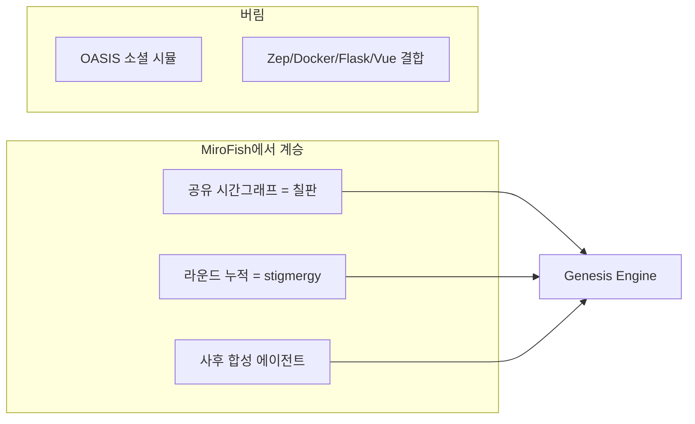
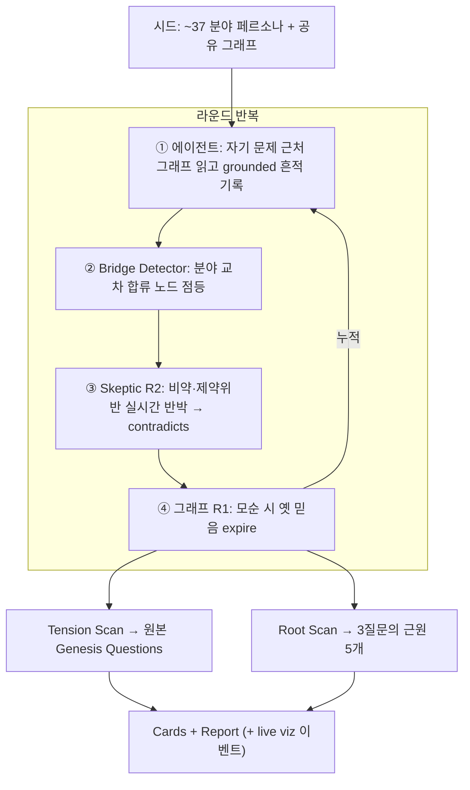

# Genesis Engine — Architecture & Build Plan

> 인류 지식 전체를 융합해, 우주·생명·마음·의미의 기원에 대해 **더 높은 지능이라면 던졌을 *질문*** 을 발굴하는 엔진.
> 답을 주장하지 않는다. 어느 단일 분야도 혼자서는 답할 수 없는 **구조적 긴장**을 찾아 근본 질문으로 벼려낸다.

상태: 코어 파이프라인(7개 분야) 동작 검증 완료. 본 문서는 **전 학문 확장 + Root Scan** 빌드의 단일 설계 기준이다.

---

## 0. 결정 기록 (왜 이 모양인가)

| 결정 | 선택 | 이유 |
|---|---|---|
| 답 vs 질문 | **질문 발굴 엔진** | "기원의 답"은 환각·검증불가. "가장 깊은 미해결 질문"은 그래프에서 구조적으로 찾을 수 있고 검증 가능. |
| MiroFish fork vs 신규 | **신규(standalone)** | 해커톤은 "standing start"를 1순위로 허용. Zep/OASIS/Docker/Flask는 우리가 안 쓰는 무게·live 실패 표면. MiroFish의 **3대 개념만 계승**. |
| 의존성 | **stdlib-only 코어 + 스왑형 두뇌** | mock 모드는 키·설치 0 → 무대에서 안 터짐. live 모드만 `anthropic`. |
| 검증자(referee) | **단일 심판 없음 → 3분할** | MiroFish엔 중앙 결정자 없음(stigmergy). 검증을 그래프/루프/사후로 분산. |
| MiroFish 시각 자산 | **격리 차용(레퍼런스)** | `GraphPanel.vue`는 MiroFish 백엔드 포맷에 강결합 → fork 대신 우리 이벤트 스트림 위에 얇은 viz를 새로. |
| 모델 배정 | **하이브리드: 에이전트=sonnet-4.6, referee/합성/Root=Opus 4.8** | MiroFish는 전 에이전트 단일 공유 모델(`gpt-4o-mini`). 우리는 물량(37 에이전트×라운드)은 sonnet으로 싸게, 어려운 융합·채점·Root 합성만 Opus로 → 비용↓ + "Opus 4.8 Use(15%)"↑. 모델은 공유, "그 연구자다움"은 페르소나+논문컨텍스트가 만든다(개별 모델/대화 히스토리 불필요 — 그래프가 기억). |
| 연구자 그라운딩 | **실제 논문 RAG (OpenAlex 초록 적재 + 검색 주입)** | "각 에이전트가 논문을 이해한 채 시작"의 충실한 구현. 모델은 범용 sonnet, 주입된 논문 코퍼스가 에이전트를 그 연구자로 만든다. 오프라인 안전을 위해 디스크 캐시 + 페르소나 폴백. |

## 1. 계승: MiroFish의 3대 뼈대만



- **수집 = 공유 그래프 누적**: 에이전트는 서로 직접 대화하지 않는다. 그래프에 흔적을 남기고, 다음 라운드에 남이 읽는다.
- **진실 갱신 = 시간적 무효화**: 사실(엣지)에 `valid/expired`. 모순 시 옛 믿음 폐기 → 지식 진화.
- **결정 = 사후 합성**: 누적된 그래프를 referee가 사후 독해해 질문을 합성.

## 2. 그래프 모델 — 연구자 = 엣지, 발견 = 노드

> 교차분야 발견은 **두 분야의 엣지가 공유하는 노드(합류점)** 에서 터진다. 그것이 곧 질문의 씨앗.

- **노드 타입**: `Researcher`, `Concept`, `Claim`, `Question`
- **엣지 타입**: `studies`, `builds_on`, `supports`, `bridges`(합류 후보), `contradicts`(긴장)
- **온톨로지(공유 개념)** — 분야 간 합류를 만드는 핵심. 물리 코어 10개 + 인문·예술·심리 확장:
  - 물리/형식 코어: `information_fundamental`, `observer_measurement`, `entropy_arrow`, `self_organization`, `emergence`, `fine_tuning`, `computation_universe`, `consciousness`, `time_origin`, `symmetry_breaking`
  - 확장(마음·의미·문화): `meaning_intentionality`, `qualia`, `language_symbol`, `self_identity`, `the_sacred`, `mathematics_effectiveness`, `narrative`, `value_aesthetics`, `representation`, `free_will`, `time_perception`, `abstraction`, `explanation_limits`, `causation`, `distinction`, `self_reference`, `nothingness`

## 3. 전 학문 로스터 (에이전트 객체)

각 분야 = 하나의 `Researcher`(인식론 페르소나: 믿음/방법/증거관/사각지대 + 라운드별 `Move` + **OpenAlex 식별자/검색어**). 프리셋으로 켜고 끈다.

| 프리셋 | 분야 |
|---|---|
| `cosmos` | 우주론, 양자기초론, 입자·통일이론, 열·통계역학, 천체물리, 생명기원화학, 지구시스템, 수학기초론, 정보이론, 계산이론, 통계·확률 |
| `mind` | 신경과학, 인지과학, 의식이론, 인공지능, 심리학(인지·발달·진화), 심층심리, 심리철학, 네트워크과학, 복잡계 |
| `meaning` | 형이상학, 인식론, 윤리·가치론, 종교·신학, 역사학, 신화학, 인류학, 고고학, 언어학, 사회학, 경제·게임이론, 미학, 시각예술, 음악, 건축, 문학, 기호학, 과학철학 |
| `all` | 위 전체(중복 제거, ~37) — **기본값** |

선택 원칙: 한 분야가 들어오려면 ① 기원 질문을 자기 렌즈로 건드리고 ② 다른 분야와 공유 개념 노드를 만들 수 있어야 한다(=bridge 가능).

### 3.1 모델 배정 (역할별)
모델은 MiroFish처럼 **공유**한다(에이전트별 개별 인스턴스/대화 히스토리 없음 — 그래프가 기억). 역할로만 분리:

| 역할 | 모델 | 이유 |
|---|---|---|
| 연구자 에이전트 `propose_move` (×37×라운드) | **sonnet-4.6** | 물량. 빠르고 저렴 |
| Skeptic `critique` (루프 내, 고빈도) | **sonnet-4.6** | 물량 |
| Synthesizer / Referee 채점 / **Root 합성** | **Opus 4.8** | 어려운 융합·반증·근원 추론 = "Opus 4.8 Use(15%)" + surprise |

정확한 모델 슬러그는 해커톤 콘솔 값 사용. 코드는 `agent_model`/`referee_model` 인자로 받아 무엇이든 주입 가능.

### 3.2 연구자 그라운딩 = 논문 RAG (OpenAlex)
"각 에이전트가 논문을 이해한 채 시작" = **그 연구자의 논문 코퍼스를 검색가능 컨텍스트로 주입**. 모델은 범용, 주입된 논문이 에이전트를 그 연구자로 만든다.

- **적재(`ingest.py`)**: OpenAlex `works` API로 연구자별 논문 제목+초록 수집(`abstract_inverted_index` 복원). 키 불필요(polite pool, `mailto`). `data/corpus/<researcher>.json`에 캐시.
- **검색(`retrieval.py`)**: 코퍼스가 작으므로 경량 토큰 중첩 점수로 현재 문제·최근 그래프 맥락에 맞는 초록 top-N 선택(stdlib, 임베딩 불요).
- **주입**: `agents.act` → `Brain.propose_move` 컨텍스트에 발췌 삽입, "반드시 이 발췌에서만 논증" 강제.
- **오프라인 안전**: 캐시 우선. 네트워크/캐시 없으면 저작 페르소나·`Move`로 폴백 → 무대 데모는 네트워크에 의존하지 않음. mock 모드는 항상 폴백 경로로 결정적 동작.

## 4. Co-Discovery 루프 (N 라운드)



## 5. 분산 Referee (검증)

| # | 위치 | 기능 | 구현 |
|---|---|---|---|
| R1 | 상시(그래프) | 모순 사실 자동 무효화, 지식 진화 | `graph.invalidate_conflicts()` |
| R2 | 루프 내 | Skeptic 실시간 반박(상관↔인과 비약, 제약 위반) | `bridge.skeptic_pass()` |
| R3 | 사후 | 질문을 rubric(근본성/융합도/탐구가능/신규성)으로 채점 | `referee.adjudicate*()` |

## 6. Tension Scan vs Root Scan (이번 빌드의 핵심 신규)

- **Tension Scan** (`tension.py`): 모든 Concept 노드를 `orphan_bridge`(분야는 만나는데 다리 부족) + `contradiction`(분야 간 모순) + `cross_centrality`(고차수·고다양성)로 채점 → **원본 Genesis Questions**(창발/it-from-bit/관찰·측정 등).
- **Root Scan** (`roots.py`, 신규): 위 3개를 `ROOT_TARGETS`로 두고, **여러 target 노드로 동시에 흘러드는 상류(upstream) 개념**을 찾는다.
  - 루트 점수 = (K홉 내 도달하는 target 수) × 분야 다양성 + 모순 압력, **단 target 자신은 제외**.
  - 직관: "이 질문에 답하면 위 세 질문이 한꺼번에 풀리거나 사라지는" 더 깊은 질문. 인문·예술이 들어오며 생기는 `distinction`, `meaning_intentionality`, `self_reference`, `nothingness` 같은 노드가 후보로 떠오른다.
  - 산출: **Root Question 5개** (각 질문 + 어느 target을 떠받치는지 + 근거/긴장 + 점수).

## 7. 두뇌 (스왑형, MiroFish CloudBrain/LocalBrain 패턴)

`Brain` 인터페이스 → `MockBrain`(결정적, 오프라인) / `ClaudeBrain`. 메커니즘 동일, 두뇌만 교체.
- 메서드: `propose_move`, `critique`(→ sonnet), `synthesize_question`, `score_question`, **`synthesize_root_question`(신규)**(→ Opus).
- `ClaudeBrain(agent_model=sonnet, referee_model=opus)` — 역할에 따라 내부에서 모델 라우팅(§3.1). 모델은 공유 클라이언트, 호출 시 슬러그만 분기.
- live 실패 시 mock 폴백.

## 8. 데이터 흐름

```
ingest(OpenAlex→캐시) ─┐
corpus(personas+openalex_id) ─┤→ retrieval(top-N 초록) ─┐
                              agents.act(논문 발췌 주입) → graph(write)
   → bridge.detect/skeptic(sonnet) → graph.invalidate
   → tension.scan → referee.adjudicate(opus) → GenesisQuestion[]
   → roots.scan   → referee.adjudicate_roots(opus) → RootQuestion[5]
   → cards/report/run.py(event stream → live viz)
```

## 9. 모듈 맵 (신규/변경)

| 파일 | 역할 | 상태 |
|---|---|---|
| `genesis/graph.py` | 공유 시간그래프(valid/expired) | 유지 |
| `genesis/corpus.py` | **온톨로지 확장 + ~37 페르소나(+OpenAlex id/검색어) + FIELD_PRESETS + ROOT_TARGETS/ROOT_QUESTIONS** | 대폭 확장 |
| `genesis/ingest.py` | **OpenAlex 논문 적재 + 초록 복원 + 디스크 캐시** | 신규 |
| `genesis/retrieval.py` | **연구자 코퍼스에서 맥락별 top-N 초록 선택(stdlib)** | 신규 |
| `genesis/brain_types.py` | `MoveResult/BridgeCandidate/TensionSite/GenesisQuestion` + **`RootQuestion`** | 추가 |
| `genesis/llm.py` | Mock/Claude 두뇌 + **역할별 모델 라우팅(agent/referee)** + **`synthesize_root_question`** | 추가 |
| `genesis/agents.py` | 그래프 읽기/쓰기 + **논문 발췌 검색·주입** | 변경 |
| `genesis/bridge.py` | 합류 탐지 + Skeptic | 유지 |
| `genesis/tension.py` | 긴장 채점 → 원본 질문 | 유지 |
| `genesis/roots.py` | **Root Scan: 3질문의 근원 탐색** | 신규 |
| `genesis/referee.py` | 채점 + **`adjudicate_roots`** | 추가 |
| `genesis/cards.py` | 카드 렌더 + **root 카드** | 추가 |
| `genesis/loop.py` | 오케스트레이션 + roots 단계 + 이벤트 | 변경 |
| `run.py` | `--preset`, rounds 상향, Root 섹션 출력/리포트 | 변경 |
| `viz/`(옵션) | 이벤트 스트림 기반 얇은 라이브 그래프 뷰 | 후속 |

## 10. 데모 (3분)

1. **0:00–0:20** 후크: "외계인에게 우주·인류의 기원을 묻는 게 꿈이다. 그 질문을 우리가 먼저 벼릴 수 있을까?"
2. **0:20–1:30** 라이브: ~37 분야 에이전트가 공유 그래프에서 토론, 합류 노드 점등·모순 폐기 실시간 스트리밍 → 원본 Genesis Questions 3개.
3. **1:30–2:40** wow: **Root Scan** — "이 셋의 근원은?" 5개 Root Question 카드 생성(예: `distinction`/`self_reference`/`nothingness` 합류). 근본성/융합도/탐구가능/신규성 점수.
4. **2:40–3:00** 클로징: 루브릭·responding URL·`--preset` 재실행으로 Orchestration 입증 + 로드맵(실제 논문 적재).

## 11. 검증 기준 (done)

- `python run.py --preset all` 오프라인(mock, 캐시/폴백) end-to-end 동작 — 네트워크 없이도 돈다.
- `python ingest.py` 1회로 OpenAlex 초록을 `data/corpus/`에 캐시 → 이후 live 모드는 캐시에서 논문 주입.
- 원본 Genesis Questions + **Root Questions 5개** 출력 및 마크다운 리포트 저장.
- live 모드: 에이전트=sonnet-4.6, referee/Root=Opus 4.8로 라우팅 확인.
- 린트 0, live 실패 시 mock 폴백 정상.
- 새 분야/프리셋으로 내일 재실행 가능(Orchestration).

## 12. 로드맵 (해커톤 이후 — 삶의 목표 디딤돌)

1. 시드 페르소나 → **실제 논문(OpenAlex/Semantic Scholar)** corpus로 교체(엔진 불변).
2. 분야·라운드 확장으로 합류점 정밀화.
3. Root Question 시계열 추적: 점점 더 많은 분야와 충돌하는 질문 = 가장 근본적.
4. 각 질문에 **반증 설계(관측/실험) 자동 제안** 단계 추가 → tractability를 실제 실험으로.

목표: 외계인에게 물을 그 질문을, 우리가 스스로 벼려낸다.
